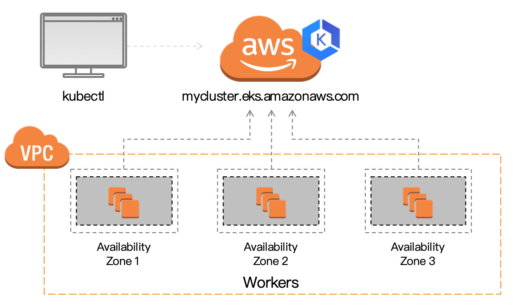
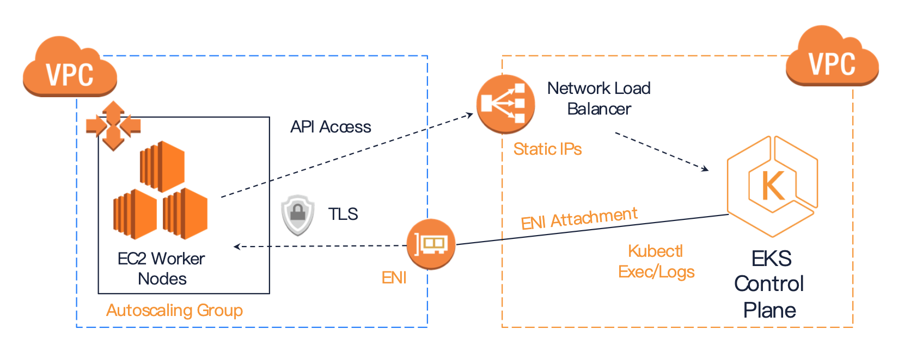
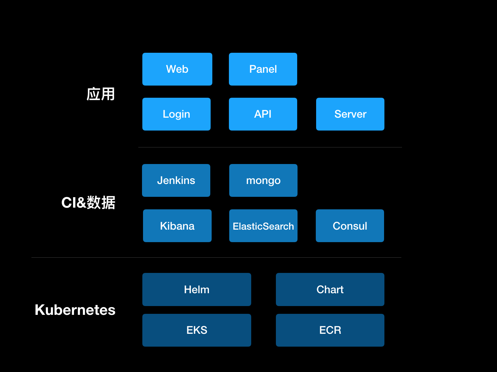
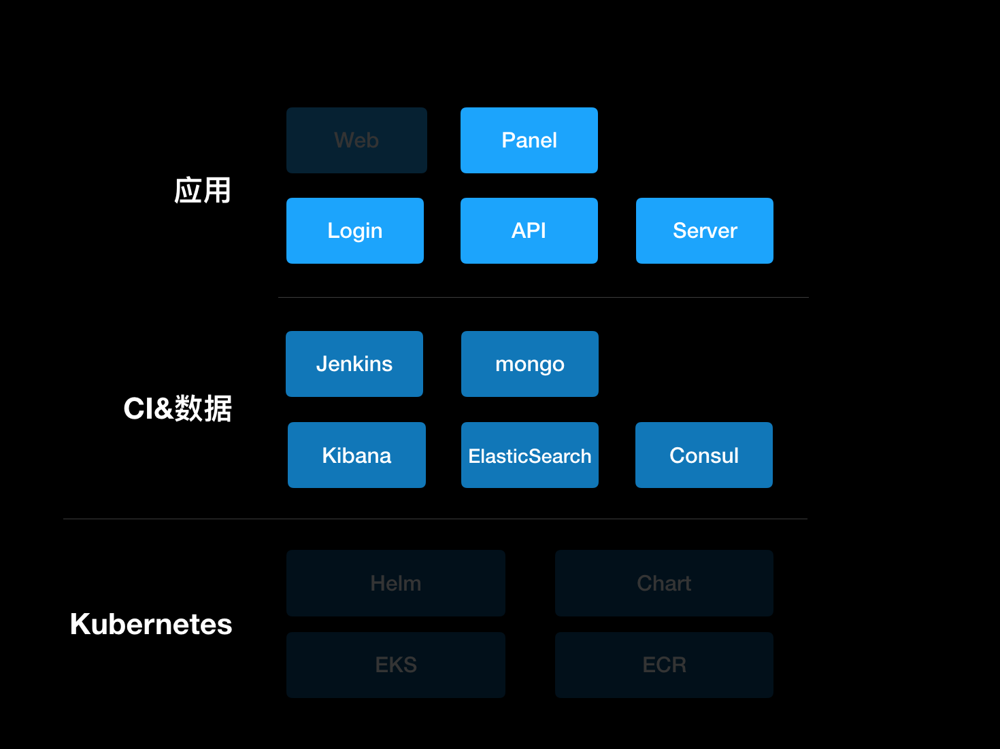

# All on Kubernetes
> Kubernetes是未来的Linux操作系统, 应用会像手机APP一样简单。

技术从业者必备的基础知识，不会在容器化环境工作的人5年内被淘汰，无论研发、运维与测试。

# Kubernetes体系
## 原生Kubernetes


## Amazon EKS


## EKS关键点


# All dockers
## 我们的应用构成


## 这些都是docker管理


## 日常工作流
*coding*
> 1. IDE开发
> 2. 测试
> 3. docker build & run

*testing*
> 部署到集成测试环境

*docker build*
> 1. 完成镜像构建与推送
> 2. 每个应用指定ECR与版本

*kubernetes release*
> 1. 编写chart
> 2. 编写ingress(是否单独制作)
> 3. helm install ONE CLICK!)

## jenkins
[jenkins charts](https://github.com/helm/charts/tree/master/stable/jenkins)
```bash
helm install --name jenkins stable/jenkins
```

## elasticsearch
```bash
helm install --name elasticsearch elastic/elasticsearch
```

## kibana
```bash
helm install --name kibana elastic/kibana
```

## consul
[consul_charts](https://github.com/helm/charts/tree/master/stable/consul)
```bash
helm install --name consul stable/consul
```


## mongo
```bash
helm install --name mongodb --set service.type=LoadBalancer --set mongodbRootPassword=password stable/mongodb
```

# 一些经验

## 保障安全
> 1. 可以使用htpasswd做basic auth认证
> 2. 接入ldap需要按照公司接入规范，例如：白名单的开启
> 3. 使用aws的secret管理密码
> 4. 对node做iam role管理，pod则需要使用三方插件管理。前者权限较粗放。
> 5. 针对最坏的情况做

## 对外暴露服务
> 1. http尽可能使用ingress做反向代理
> 2. tcp的暴露需要一些ingress技巧，不如ELB简化
> 3. 给自己服务命名，如：jenkins.spotmaxtech.com, kibana.spotmaxtech.com

## 日志
> 1. 部署fluentd daemonSet，每个节点都有，集中收集转发（待完善）
> 2. 我们当前用的实时ES

## EKS监控
> 1. 安装dashboard（失败了，需要再看看）

## 磁盘
> 1. gp2，pod申请与自动扩容机制还需要再学习

## 其他
> 小组成员如果不是全栈，需要解决机器权限、域名管理、容器安装等事情。
如果可以，强烈建议小组具备独自管理资源的权限，如：aws的账号划分机制